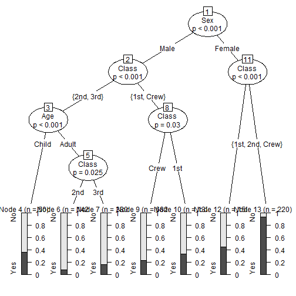

Surviving the Sinking Titanic:  A quick guide to understanding your odds
========================================================
author: AV
date: 27 April 2016

Background
========================================================
The intent of the Titanic Survival app is to explore and understand the relationship between Cabin Class, Sex and Age of a person to their corresponding odds of survival, and in turn predict the probability of survival given these inputs.
The algorithm powering the app is a Conditional Decision Tree, as it helps present the relationship between input and response varibales in a way that is easy to interpret.

The app can be found here: 

https://avzz.shinyapps.io/Titanic/

The documentation and code for the app can be found here:

https://github.com/avzztime/Developing-Data-Products

Building the Model
========================================================
The Titanic dataset from base R is used to build the model, applying the ctree algorithm in the PARTY package.

There are 3 input variables( all factors):

- Cabin Class, Sex and Age

The output is a 2 class probability for survival and death, and a 50% cut off is used to make the response binary.
Below is a confusion matrix on the model performance


```
      Predicted
Actual  No Yes
   No  293   5
   Yes  93  49
```

CTREE Plot
========================================================
The plot below is the final output, and tells us how the various input variables impact the probability to survive the sinking Titanic.



Applications
========================================================
The app provides insights to the impact that socio-economic standards and gender bias had on the odds for survival among everyone onboard the Titanic. 

While this app is a relatively simple use case,the concept of using data to reveal such underlying trends is very powerful, and can be extended to multiple spheres of life.
